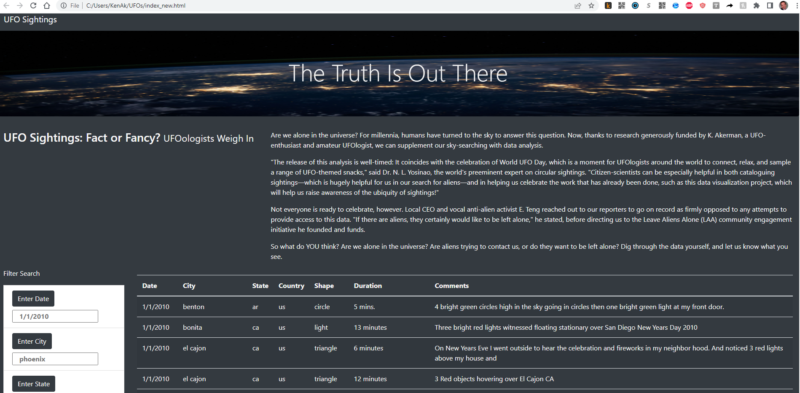

# UFOs

##### IMPORTANT NOTE: With the help of AskBCS Learning Assistants, I got the JavaScript and HTML files working as intended. However, the naming conventions may not match the names as exactly stated in the Challenge requirements. I don't want risk renaming files and messing up what is working. 

##### Therefore, the working Javascript file is app2.js, and the working HTML file is index_new.html. If I need to change these names, then please let me know and I will do that, and resubmit.

##### Overview of Project: Explain the purpose of this analysis.

###### The purpose of this analyis is to write a JavaScript module to filter UFO data observations by the following criteria, as selected by the user:

• Date of observation

• City or town where observation made

• State or province where city or town is located

• Country of observations (us for USA or ca for Canada)

• Shape of the UFO as noted by observer (i.e. circle, triangle, sphere, disk, cigar, etc.)

##### Results: How to use the webpage

The home page features a panoramic banner at the top, followed by a written summary of the project. Below the written summary is a list of all of the UFO sightings in the database. Each line of UFO data includes the following column headers:

• Date

• City	
• State	
• Country	
• Shape
• Duration
• Comments

There are over 100 observations recorded in the database, as shown below. To make it easier to find data, the home page is linked to a JavaScript program to enable the user to select only those records that match relevant criteria.

To the left of the data table is a column titled "Filter Search." In these data fields, the user can filter by relevant criteria by entering values in one or more of the search boxes. Placeholder data (in grey) is initially placed in the boxes, as shown here:

When the user enters data in a search box, that data entry turns red to show that it is user input. For example, to find all of the UFO observations on 1/4/2010, the user enters that date in the first search box, and clicks the button or hits the "Enter" key. 

This returns eight observations recorded on that day:

If the user wants to select only those observations on that day in a single state - i.e. California (ca), then the user enters the two-letter state abbreviation in the appropriate box:

This reduces the original eight observations of 1/4/2010 to the three recorded in California. The user can continue refining the search by adding additional criteria - in this example, adding "light" to the filter by shape, which returns two records:

If one selects only the "City" data, then JavaScript returns all observations recorded in the city of that name, even if they are different cities with the same name in two or more different states. In this example, there are two observations made in cities with the name "Cleveland," one in Ohio and the other in Tennessee:

To return to the original full database listing, clear the Filter Search boxes and refresh the home page.

Summary: In a summary statement, describe one drawback of this new design and two recommendations for further development.
